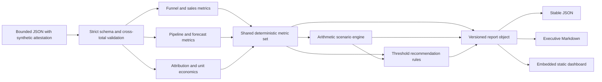
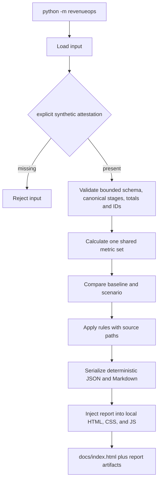

# RevenueOps-360

[](https://github.com/didier-lioniello/RevenueOps-360/actions/workflows/ci.yml)
[](https://github.com/didier-lioniello/RevenueOps-360/actions/workflows/pages.yml)

[Open the live synthetic dashboard](https://didier-lioniello.github.io/RevenueOps-360/).

> **SYNTHETIC DATA · DEMONSTRATION ONLY**
> The bundled fixture contains no customer, company, or personal data. No LLM. No client promise.

RevenueOps-360 is a deterministic, standard-library Python reference implementation that connects
B2B funnel conversion, sales velocity, forecasting, marketing attribution, unit economics, scenario
planning, and traceable operating recommendations.

It generates reproducible JSON and Markdown reports plus a responsive static dashboard under
[`docs/`](docs/). The dashboard embeds its report and works without an API, database, analytics tag,
CDN, or external service. A strict Content Security Policy permits only its local script, stylesheet,
and data-safe images.

This repository demonstrates analytical and operating judgment. It is not production-ready, a CRM,
a financial model, or evidence of customer outcomes.

## Role-to-evidence map

| Role / capability | Evidence in the repository |
|---|---|
| CRO | Target attainment, commit/best-case/weighted forecast, in-period pipeline coverage, quantified gaps, sensitivity scenario |
| Sales leadership | Stage conversion, closed-deal win rate, ACV, cycle time, sales velocity, explicit handoff and cycle rules |
| Digital marketing | Synthetic first-touch attribution, channel spend, won ACV, gross-profit ROI, ROAS, CPL and channel CAC |
| B2B scaling | Blended CAC, CAC payback, simplified LTV:CAC, conversion/ACV/cycle/spend sensitivity |
| Revenue Operations | Strict input validation, consistent metric definitions, deterministic build, evidence paths, cross-functional report |
| Executive communication | Static command-center UI, concise Markdown brief, useful charts, assumptions and limits next to decisions |

## Demo output

The committed static demo is built from [`data/synthetic_revenue.json`](data/synthetic_revenue.json):

- 400 fictional leads across four generic channels;
- 20 synthetic opportunity records identified only as `SYN-OPP-*`;
- six closed-won records, ten closed-lost records, and four open records;
- one explicitly modeled scenario using relative conversion, ACV, cycle, and spend changes.

The report remains embedded in an inert HTML template, so the app does not fetch runtime data. For
consistent CSP behavior across browsers, preview [`docs/index.html`](docs/index.html) through a local
static server. The build also emits [`docs/report.json`](docs/report.json) and
[`docs/report.md`](docs/report.md).

## Architecture



## Reproducible workflow



There is no hidden scoring service and no generated advice. The same report object powers the CLI
artifacts and the dashboard.

### Synthetic-data attestation boundary

`metadata.synthetic: true`, a label beginning with `SYNTHETIC`, and `SYN-OPP-*` record identifiers are
an explicit **operator attestation**. They are not a classifier or proof that input is safe. This
project does not detect, redact, or anonymize PII, customer data, credentials, or confidential text.
The parser rejects unknown fields and applies bounded lengths, cardinalities, counts, and monetary
values, but those controls do not make real exports acceptable. Use only purpose-built fictional
fixtures.

## Quickstart

Python 3.11 or 3.12 is recommended. Runtime uses only the standard library.

```bash
python -m pip install .
revenueops --version

python -m revenueops analyze \
  --input data/synthetic_revenue.json \
  --output-dir build/report

python -m revenueops build-site \
  --input data/synthetic_revenue.json \
  --output-dir docs
```

Preview the strict-CSP static files through Python, then open `http://localhost:8000`:

```bash
python -m http.server 8000 --directory docs
```

### Override the modeled scenario

All changes are relative percentages. A conversion lift is applied to each stage and capped at
100%; marketing lead volume changes linearly with spend in this deliberately simple model.

```bash
python -m revenueops analyze \
  --scenario-name "Focused efficiency v2" \
  --conversion-lift 6 \
  --acv-change 4 \
  --cycle-change -12 \
  --spend-change 3 \
  --output-dir build/custom-scenario
```

Fractional modeled deals are expected-value planning units. They are not promised customers or a
causal forecast.

## Metric definitions

| Metric | Implemented definition |
|---|---|
| Stage conversion | next-stage cohort / previous-stage cohort |
| Closed-deal win rate | won / (won + lost) |
| ACV | closed-won ACV / won deals |
| Average cycle | mean close date minus created date across closed deals |
| Sales velocity | funnel opportunities × opportunity-to-won rate × ACV / average cycle days |
| Pipeline coverage | in-period open ACV / remaining target; out-of-period deals are excluded |
| Commit forecast | actual + full ACV of in-period commit opportunities |
| Best-case forecast | actual + in-period commit + in-period best-case ACV |
| Weighted forecast | actual + sum of in-period open ACV × supplied probability |
| Channel ROAS | first-touch attributed closed-won ACV / spend |
| Channel ROI | (first-touch attributed closed-won ACV × gross margin rate − spend) / spend; unavailable without margin |
| Blended CAC | (marketing spend + sales acquisition spend) / new customers |
| CAC payback | blended CAC / (ACV × gross margin / 12) |
| Simplified LTV:CAC | (ACV × gross margin / annual logo churn) / blended CAC |

Undefined ratios are returned as `null`, never zero-filled. CAC payback and LTV:CAC are calculated
only when the required synthetic inputs exist.

## Explainable recommendations

Recommendations are deterministic threshold rules. Each item contains:

- a stable `rule_id` and priority;
- a factual finding;
- a reversible, testable action rather than a promise;
- one or more evidence records with the exact report path, value, and comparison;
- the engine identifier `deterministic-threshold-rules-v1`.

Examples include weighted forecast gaps, in-period coverage shortfalls, the weakest funnel handoff,
long cycle review, low channel ROI, and unit-economics review thresholds.

## Evidence

Reproduce the current evidence locally:

```bash
python -m pip install --require-hashes -r requirements-dev.txt
python -m ruff check .
python -m ruff format --check .
python -m pytest
python -m build --wheel --no-isolation
python -m revenueops build-site --output-dir docs
git diff --exit-code -- docs
python -m pip_audit -r requirements-dev.txt --strict
actionlint
```

The current suite contains 27 offline tests covering formulas, validation failures, canonical-stage
and cross-total consistency, input bounds, finite calculations and serialization, forecast-period
exclusion, attribution, unit-economics edge cases, scenario levers, determinism, rule evidence, CLI
overrides, zero-value Markdown, package metadata, report generation, strict-CSP responsive assets,
and a build with no external URL. CI installs the hash-locked toolchain,
then repeats lint, tests, dependency auditing, wheel/entrypoint verification, and the demo build on
Python 3.11 and 3.12. Concurrent runs on the same ref are cancelled and push CI runs only on `main`.
CodeQL analyzes Python, dependency review blocks newly introduced moderate-or-higher
vulnerabilities, every official action is pinned to an immutable release SHA, and the JavaScript
actions run on Node 24. Dependabot monitors Python development and Actions dependencies. A separate
least-privilege Pages workflow rebuilds and diff-verifies `docs/` before deploying it.

## Project layout

```text
data/                       explicitly labeled synthetic input
pyproject.toml              installable package and console-script metadata
requirements-dev.in         direct development constraints for lock generation
requirements-dev.txt        pip-compile hash lock for the Python 3.11/3.12 CI toolchain
revenueops/models.py        validation and typed records
revenueops/analytics.py     funnel, sales, forecast, attribution, unit economics
revenueops/scenario.py      baseline and modeled sensitivity comparison
revenueops/recommendations.py  deterministic evidence-linked rules
revenueops/reporting.py     stable JSON and Markdown output
revenueops/site.py          static-site build
revenueops/web/             local HTML, CSS, and JavaScript sources
docs/                       committed generated demonstration
tests/                      offline formula, validation, CLI, and build tests
```

## Known limitations

- The sample is synthetic and small; its values demonstrate formulas, not market benchmarks.
- Synthetic markers and `SYN-OPP-*` identifiers are operator attestations only. The parser has no
  PII, secret, customer-data, or confidential-text detection or redaction capability.
- Funnel snapshots are aggregate cohorts, while win rate uses closed opportunity outcomes.
- First-touch attribution ignores multi-touch influence and incrementality.
- Supplied opportunity probabilities are accepted inputs, not calibrated predictions.
- The scenario assumes linear spend-to-lead response and applies one relative lift across stages.
- Simplified LTV uses ACV, gross margin, and logo churn; it ignores expansion, contraction, discount
  rate, cohort timing, and cost-to-serve changes.
- The local tool has no authentication, concurrency control, database, CRM sync, audit service,
  observability, deployment hardening, or SLA.
- Recommendations are review prompts. They do not guarantee revenue, efficiency, or customer impact.

See [SECURITY.md](SECURITY.md) for the synthetic-data boundary and vulnerability reporting, and
[CONTRIBUTING.md](CONTRIBUTING.md) for development rules.

## License

MIT — see [LICENSE](LICENSE).
